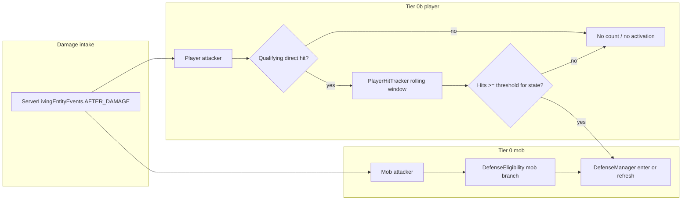

# Phase A2 — Tier 0b: Player-activated defense

## North-star alignment ([VILLAGER_DEFENSE_CORE.md](VILLAGER_DEFENSE_CORE.md))

| CORE item                                                                                       | Phase A2 scope                                                                                                                                                                                                                                                                                                                                                                                                                                                                                                                                                                                                                                       |
| ----------------------------------------------------------------------------------------------- | ---------------------------------------------------------------------------------------------------------------------------------------------------------------------------------------------------------------------------------------------------------------------------------------------------------------------------------------------------------------------------------------------------------------------------------------------------------------------------------------------------------------------------------------------------------------------------------------------------------------------------------------------------- |
| **§ Intended behavior #3** — repeated player hits activate defense; same group rules at Tier 1+ | Implement **activation gating only**; Tier 1 radius/allies is **out of scope** (defer to Phase B).                                                                                                                                                                                                                                                                                                                                                                                                                                                                                                                                                   |
| **Defense activity priority**                                                                   | **No change** — reuse existing `[DefenseBrainHooks](src/main/java/villager_self_defense/brain/DefenseBrainHooks.java)` / `[ModDefenseActivities](src/main/java/villager_self_defense/brain/ModDefenseActivities.java)` path once defense turns on.                                                                                                                                                                                                                                                                                                                                                                                                   |
| **Player escalation (locked)**                                                                  | **3** hits / **10 s** to **first** activate defense (villager not yet in defense vs this situation). **6** hits / **10 s** while **already in defense** is CORE’s “further escalation” threshold — in the **full** design that extra step is for **pack-level** behavior (e.g. ally notification in Tier 1). **Tier 0b has no separate gameplay unlock at 6 hits** (single villager, no allies): still implement the **counter + config + threshold logic** so behavior matches CORE and Phase B can attach real effects. Optional: a **no-op hook** (e.g. `onPlayerDefenseEscalation`) called when the 6-hit threshold fires, reserved for Phase B. |
| **Creative / peaceful / indirect**                                                              | Ignore players who must not trigger retaliation: **creative** (already partially handled), add **peaceful** (world/player difficulty) per CORE; **indirect** damage does **not** increment hit counts — only **direct** melee/projectile-style attribution (see below).                                                                                                                                                                                                                                                                                                                                                                              |
| **Friendly fire / targets**                                                                     | **No change** to villager/golem rules for A2; ensure player path does not widen targeting beyond existing eligibility.                                                                                                                                                                                                                                                                                                                                                                                                                                                                                                                               |
| **Babies / trading / stand-down**                                                               | **No redesign** — `[VillagerDefenseState](src/main/java/villager_self_defense/defense/VillagerDefenseState.java)`, trading close/block in `[DefenseManager](src/main/java/villager_self_defense/defense/DefenseManager.java)`, quiet-window stand-down stay as-is once defense is active.                                                                                                                                                                                                                                                                                                                                                            |
| **Config-first**                                                                                | Add Tier 0b keys to `[ModConfig](src/main/java/villager_self_defense/config/ModConfig.java)` (window seconds, both thresholds, toggles per CORE table — e.g. `playerActivationEnabled`, `playerHitWindowSeconds`, `playerHitsToActivate`, `playerHitsWhileInDefense`, `ignoreCreativePlayers`, `ignorePeacefulPlayers` — exact names to match existing Gson style).                                                                                                                                                                                                                                                                                  |

## Current code gap

- Today, `[DefenseEligibility.shouldActivateDefense](src/main/java/villager_self_defense/defense/DefenseEligibility.java)` allows **immediate** retaliation vs players when `retaliateAgainstPlayers` is true.
- Phase A2 **replaces** “first hit activates” with **hit-bucket gating** for players, while **non-player** attackers keep **immediate** activation (Tier 0 unchanged).

## Architecture (concise)

## Implementation plan

### 1. Qualifying hit policy (server-only)

- Add a small helper (e.g. in `defense` package) that returns whether a damage event **counts** toward Tier 0b escalation:
  - **Must** align with CORE: not creative (if toggle on), not peaceful (if toggle on), and **direct** player involvement — typically `DamageSource` has a **direct** entity chain that resolves to the player for melee/projectiles; **do not** count pure environmental/indirect sources (fire tick with no direct player, explosions without player projectile, etc.). Reuse or refine the existing `resolveAttacker`-style logic in `[DamageHandler](src/main/java/villager_self_defense/defense/DamageHandler.java)` so **mob** and **player** paths share one notion of “who is the attacking living entity” vs “what counts as a player escalation strike.”

### 2. `PlayerHitTracker` (or equivalent)

- **Server-authoritative** structure: keyed by **player UUID**, store hit **game times** (or tick stamps) for qualifying hits in the rolling window.
- On each qualifying hit on **any** adult villager: append timestamp, prune entries older than `playerHitWindowSeconds * 20` ticks.
- **Threshold selection** (CORE):
  - If **this** villager is **not** `defenseActive` **or** not yet defending vs this player (clarify in code: default = use `!state.defenseActive` for Tier 0b-only scope): require `**playerHitsToActivate`** (default **3**).
  - If **this** villager **is** already in defense (`defenseActive`) and the attacker is this player: compare hit count to `**playerHitsWhileInDefense`** (default **6**). **Semantics in Tier 0b:** crossing 6 hits does **not** need to change combat (target refresh already happens on individual hits per existing `DefenseManager` logic); the threshold is **wired for CORE parity** and for **Tier 1** to hook ally broadcast later. Optionally invoke a stub `onPlayerDefenseEscalation(level, villager, player)` when count ≥ 6 in-window so Phase B only fills in implementation.
- **“Village-wide” hit counting vs Tier 1 radius (do not conflate):**
  - **Tier 0b (this phase):** Implement **per-player** rolling hit timestamps only — e.g. `Map<UUID, LongArrayList or deque of gameTime>` keyed by **attacking player**. Any qualifying damage to **any loaded adult villager** appends one timestamp to **that player’s** list (then prune by window). **No** `Level` spatial query, **no** 3D radius, **no** “notify allies” loop — that is **Phase B (Tier 1)**.
  - **Semantics:** When the in-window count crosses the activation threshold **on this damage event**, **only the villager being hit right now** enters defense (victim of the crossing hit). Prior hits could have been on **other** villagers; they still incremented the same aggressor bucket (CORE: same player, any villager).
  - **Tier 1 / alert system:** The **configurable 3D ally radius** ([VILLAGER_DEFENSE_CORE.md](VILLAGER_DEFENSE_CORE.md) defaults, group response) applies when **broadcasting** defense to neighbors — **out of scope for A2**. Document in a one-line class comment on the tracker; CORE allows refining “any loaded villager” vs dimension/chunk scope later.

### 3. `DefenseManager.onAfterDamage` split

- **Non-player attacker:** keep current behavior: eligibility → enter/refresh as today.
- **Player attacker:**
  - If not qualifying for counting → return without activation.
  - Increment tracker; if below threshold → return **without** entering defense (single accidental hit does nothing).
  - If at/above threshold → same as today: `enterDefense` / `refreshThreat`, `DefenseBrainHooks.activate`, close merchant UI.

### 4. `DefenseEligibility` refactor

- **Mobs:** unchanged policy (`mobDefenseEnabled`, baby filter, etc.).
- **Players:** replace “instant activation when `retaliateAgainstPlayers`” with:
  - **Gate:** `playerActivationEnabled` (or rename `retaliateAgainstPlayers` to this meaning) — when false, players never activate Tier 0b.
  - **Activation** is decided by `DefenseManager` **after** hit counts, not by a single `shouldActivateDefense` boolean for players. Eligibility can expose static helpers: `isAdultVillagerTarget`, `isIgnoredPlayer`, `isDirectQualifyingPlayerHit`, etc., to avoid duplicating checks.

### 5. Config + migration

- Extend `[ModConfig](src/main/java/villager_self_defense/config/ModConfig.java)` with Tier 0b fields and defaults from CORE; in `load()`, preserve backward compatibility for existing `villager_self_defense.json` (merge defaults for new keys like Phase A did for `retaliateAgainstPlayers`).

### 6. Tests / sign-off doc

- Add `**phaseA2Test.md`** (or extend a single manual test doc) mirroring [phaseATest.md](phaseATest.md): scenarios for **single hit forgiveness**, **3 hits in 10s → defense**, **creative/peaceful ignored**, **indirect damage does not count**, **Tier 0 mob behavior unchanged**, **once active, behavior matches Tier 0** (melee vs player, stand-down, trading rules).
- Update [VILLAGER_DEFENSE_IMPLEMENTATION.md](VILLAGER_DEFENSE_IMPLEMENTATION.md) checklist only if you want the backlog ticked — optional.

## Exit criteria (from implementation doc)

- Single accidental player hit does **not** trigger defense.
- Sustained poking (3 hits in window) **does** trigger defense; after activation, behavior matches Tier 0 (same Defense activity, stand-down, trading).
- Creative/peaceful/indirect rules per CORE for **escalation counting**.

## Explicitly out of scope (later phases)

- **Phase B / B2:** ally radius, dispersal, multi-threat assignment — only ensure Tier 0b does not block a clean hook (e.g. 6-hit escalation stub).
- **Gear / pickup (Phase C).**

