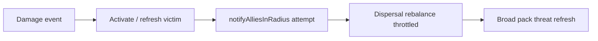

# Phase B2 / Tier 1b — Multi-attacker dispersal

## Current baseline (what you have)

- `[DefenseManager](src/main/java/villager_self_defense/defense/DefenseManager.java)` calls `[AllyDefenseNotifier.notifyAlliesInRadius](src/main/java/villager_self_defense/defense/AllyDefenseNotifier.java)` on **every qualifying hit** along the active defense paths:
  - **Mobs:** `activateOrRefreshMobDefense` invokes notify both on first activation and on every subsequent hit while already in defense (including when the victim’s target UUID is updated to a new attacker).
  - **Players (Tier 0b):** while defending against the **same** player, each qualifying hit refreshes threat, reapplies fight state, and **calls notify** (same-target branch) — not only on activation or retarget.
- `[VillagerDefenseState](src/main/java/villager_self_defense/defense/VillagerDefenseState.java)` stores a **single** `targetUuid`; `[DefenseBrainHooks](src/main/java/villager_self_defense/brain/DefenseBrainHooks.java)` drives `ATTACK_TARGET` / `FIGHT`.
- **Notifier throttle (still applies):** `[AllyDefenseNotifier](src/main/java/villager_self_defense/defense/AllyDefenseNotifier.java)` short-circuits if `time - last < allyNotifyMinTicks` for the same victim–attacker pair (`LAST_NOTIFY_TICK_BY_PAIR`). So DefenseManager **attempts** notify every hit; the **full ally scan / recruitment** only runs when the throttle allows. When planning dispersal hooks, assume **high call frequency** from DefenseManager but **possibly sparse** effective passes depending on `allyNotifyMinTicks` — or run dispersal on a **separate throttle** so dispersal rebalance is not tied to whether allies were re-notified this tick.
- `[AllyDefenseNotifier](src/main/java/villager_self_defense/defense/AllyDefenseNotifier.java)` lines 55–57 **skip** allies who are already defending a **different** attacker (prevents stealing them into another fight) — keep this for recruitment; dispersal runs **after** allies are aligned to the current broadcast target for that hit.
- Pack refresh `[refreshPackThreatNeighbors](src/main/java/villager_self_defense/defense/AllyDefenseNotifier.java)` only updates villagers whose `targetUuid` **equals the current damager** — this is incorrect for multi-threat stand-down per [VILLAGER_DEFENSE_CORE.md](VILLAGER_DEFENSE_CORE.md) (“no villager in the relevant area is attacked…”). **Change:** refresh `lastThreatGameTime` for **all** adult defending villagers within the 3D ally radius of the **victim** (any target), so quiet-stand-down works when different zombies hit different villagers.

**Implication for Tier 1b:** Dispersal must **not** perform an unconstrained full rebalance on every `notifyAlliesInRadius` entry (that could still be many times per second if throttle is low). Use `**dispersalRebalanceMinTicks`** (and sticky assignment) as the primary guardrail; optionally treat “new threat UUID in sphere” as a **forced** rebalance even inside the interval.

## Config (`[ModConfig](src/main/java/villager_self_defense/config/ModConfig.java)`)

Add fields (with defaults aligned to [VILLAGER_DEFENSE_CORE.md](VILLAGER_DEFENSE_CORE.md) §Recommended defaults / §Configuration surface):

| Key                                | Purpose                                                  | Suggested default       |
| ---------------------------------- | -------------------------------------------------------- | ----------------------- |
| `dispersalEnabled`                 | Toggle; `false` = Phase B only (single shared target)    | `true`                  |
| `dispersalMaxAttackersK`           | Cap threats considered                                   | `8`                     |
| `dispersalRebalanceMinTicks`       | Min ticks between full assignment passes (unless forced) | `15`                    |
| `dispersalMaxDefendersPerAttacker` | Soft cap (0 = unlimited)                                 | `0` or tunable e.g. `8` |

Extend `[applyDefaultsForMissingKeys](src/main/java/villager_self_defense/config/ModConfig.java)` for backward-compatible loads. Update `[run/config/villager_self_defense.json](run/config/villager_self_defense.json)` only if you want dev defaults checked in (optional).

## Threat discovery (new helper)

- **Scope:** Same **3D sphere** as Tier 1: center = **anchor villager** (the damage victim for that event), radius = `config.allyRadius` (reuse existing pattern in `AllyDefenseNotifier`: `AABB.inflate` + `distanceToSqr` check).
- **Population:** Query `LivingEntity` in the box (e.g. `level.getEntitiesOfClass(LivingEntity.class, box, predicate)`), filter to **valid threats**:
  - Alive, same dimension, within sphere.
  - **Exclude** other villagers and iron golems ([VILLAGER_DEFENSE_CORE.md](VILLAGER_DEFENSE_CORE.md) friendly-fire rules).
  - **Players:** same policy as group notify — ignore creative / Peaceful (`[DefenseEligibility.playerIgnoredForRetaliation](src/main/java/villager_self_defense/defense/DefenseEligibility.java)`).
  - **Include** non-player living entities that can actually be attack targets in practice: at minimum vanilla hostiles (`Monster` or equivalent) plus any entity type you already allow as attackers in Tier 0 (avoid treating cows as “threats”). Centralize this in one place (e.g. `DefenseEligibility.isValidThreatTarget(LivingEntity, ServerLevel, ModConfig)`) so dispersal and future features stay consistent.
- **K cap:** Sort by distance to anchor (or to pack centroid — anchor is simpler and matches “proximity”), take first `dispersalMaxAttackersK`.

## Assignment algorithm (`DefenseDispersal` or similar)

- **Trigger dispersal only if** `dispersalEnabled && threats.size() > 1`. If `threats.size() <= 1`, no change from Phase B.
- **Throttle:** Track **last global rebalance game time per `ServerLevel`** (or per-anchor with a short dedupe key) so you do not run full greedy assignment every tick or on every entity’s `DefenseManager.tick`. On **damage events**, allow rebalance if `time - last >= dispersalRebalanceMinTicks` **or** mark “forced” when the **set of threat UUIDs** changes meaningfully (e.g. new UUID not in previous pass) to satisfy “new damage source / threat enters” without waiting.
- **Defender set:** Adult villagers in the same 3D sphere with `defenseActive` (include victim and recruited allies). Cap count with existing `maxAlliesNotifiedPerEvent` philosophy — the same sphere already bounds work; optionally reuse that cap as a **maximum defenders per rebalance** if you need a hard bound.
- **Sticky (default):** For each defender, if current `resolveTarget()` is non-null, still alive, still in the **threat list**, and still within range of the anchor sphere, **keep** assignment until a rebalance pass runs (interval or forced event).
- **Greedy reassignment:** When rebalance runs, clear stickies for that pass and assign each defender to the **nearest** threat (by `distanceToSqr(defender, threat)`), with optional **soft cap**: if `dispersalMaxDefendersPerAttacker > 0`, prefer next-nearest threat when the nearest is at cap (simple load spread; tie-break with stable ordering e.g. entity ID for determinism).

## Integration points

1. `**DefenseManager.onAfterDamage`** (after ally notify / activation paths): call dispersal rebalance when enabled and `threats.size() > 1`, respecting throttle. Ensure **player** and **mob** paths both reach the same hook so Tier 0b + Tier 1 stay unified.
2. `**DefenseManager.tick`**: optional **staggered** interval rebalance (e.g. only when `gameTime % dispersalRebalanceMinTicks == 0` and only for villagers with `defenseActive`) so threats **entering** the sphere without new damage still get reassigned within the core doc’s 10–20 tick band — **without** scanning all entities every tick: reuse one anchor (the villager being ticked) and throttle globally so at most one heavy pass per interval per level.
3. `**DefenseBrainHooks`**: no API change; dispersal only updates `state.targetUuid` + `activate`/`applyFightState` as today.

## Behavioral edge cases (explicit)

- **Recruitment rule unchanged:** Allies already defending a **different** attacker **outside** this recruitment story stay skipped (lines 55–57). Dispersal does not need to pull them in.
- **Single threat:** No dispersal pass; behavior matches current Phase B.
- **Target death:** Existing `[DefenseManager.tick](src/main/java/villager_self_defense/defense/DefenseManager.java)` stand-down when `resolveTarget()` is null remains; after dispersal, each villager’s target is independent.

## Testing (manual / checklist)

- Two zombies on opposite sides of a villager cluster → defenders split; no obvious pathing thrash (watch with sticky + interval).
- One zombie → unchanged pile-on.
- `dispersalEnabled: false` → everyone still focuses one target (debug fallback).
- Hit villager A with zombie 1, villager B with zombie 2 within radius → stand-down timer refreshes for **both** after either line takes damage (after broad pack refresh fix).
- Many mobs loaded: K caps threat list; no noticeable tick spike (profile `getEntitiesOfClass` + sort cost).

## Files likely touched

- New: `defense/DefenseDispersal.java` (or split scanner + assigner if large).
- Edit: `[DefenseEligibility.java](src/main/java/villager_self_defense/defense/DefenseEligibility.java)` (threat predicate), `[DefenseManager.java](src/main/java/villager_self_defense/defense/DefenseManager.java)`, `[AllyDefenseNotifier.java](src/main/java/villager_self_defense/defense/AllyDefenseNotifier.java)` (pack refresh), `[ModConfig.java](src/main/java/villager_self_defense/config/ModConfig.java)`.
- Docs: optional one-line note in [VILLAGER_DEFENSE_IMPLEMENTATION.md](VILLAGER_DEFENSE_IMPLEMENTATION.md) checklist B2 only if you want the backlog updated (not required for code correctness).

