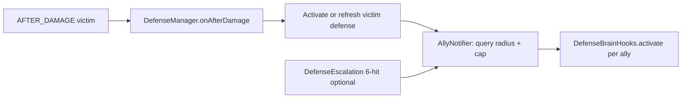

# Phase B — Tier 1: Group response (allies in radius)

## Goal (from [VILLAGER_DEFENSE_IMPLEMENTATION.md](VILLAGER_DEFENSE_IMPLEMENTATION.md))

Villagers within **R** blocks of the **victim** also acquire the **same** attacker target, whether activation came from **mob** damage ([DefenseManager.activateOrRefreshMobDefense](src/main/java/villager_self_defense/defense/DefenseManager.java)) or **player** activation ([enterDefenseAgainstAttacker](src/main/java/villager_self_defense/defense/DefenseManager.java)). **Out of scope for Phase B:** multi-attacker dispersal (that is **Phase B2**).

## Architecture

## 1. Config ([ModConfig.java](src/main/java/villager_self_defense/config/ModConfig.java))

Add Tier 1 keys aligned with [VILLAGER_DEFENSE_CORE.md](VILLAGER_DEFENSE_CORE.md) (recommended defaults):

- `**groupDefenseEnabled**` (boolean, default `true`) — master toggle for ally recruitment.
- `**allyRadius**` (double, default **16**) — 3D sphere: use squared distance `distSq <= allyRadius * allyRadius` (not horizontal-only).
- `**maxAlliesNotifiedPerEvent`** (int, default **32**) — cap how many *additional* villagers are pulled in per notification pass.
- `**allyNotifyMinTicks`** (int, default **5** or **10**) — minimum game ticks between **repeat** ally broadcasts for the same `(victimId, attackerId)` pair to reduce thrash when damage events spam (complements “event-driven” from core doc).

Extend `applyDefaultsForMissingKeys` for backward-compatible loads.

## 2. Ally recruitment logic (new helper or inner API)

Introduce a focused class (e.g. `AllyDefenseNotifier` in `defense/`) responsible for:

1. **Query**: From the **victim** villager’s position, collect nearby `Villager` entities (server level). Prefer `getEntitiesOfClass` with an inflated `AABB` then **sphere-filter** by distance squared for correctness and a bit of performance vs scanning the whole level.
2. **Filter**: Adults only (`!isBaby()`), alive, same `ServerLevel`, **exclude the victim**. Reuse existing policy where it already exists: e.g. do not pull allies for attackers that [DefenseEligibility](src/main/java/villager_self_defense/defense/DefenseEligibility.java) would ignore for **players** (creative / peaceful) — the victim already passed activation, but allies should not chase invalid targets.
3. **Activate each ally** using the same path as the victim: `VillagerDefenseState.enterDefense(attacker, time)` + [DefenseBrainHooks.activate](src/main/java/villager_self_defense/brain/DefenseBrainHooks.java) + [closeMerchantUiForVillager](src/main/java/villager_self_defense/defense/DefenseManager.java) (extract shared “enter defense UI + brain” into a package-private or shared method if needed to avoid duplication bugs).
4. **Target conflict**: If an ally is already `defenseActive` with a **different** `targetUuid`, **skip** switching for Phase B (avoids oscillation; Phase B2 can revisit). If already same target, **refresh** threat only (see §3).
5. **Cap**: Stop after `maxAlliesNotifiedPerEvent` allies processed (deterministic order, e.g. sorted by distance so nearest neighbors join first).

**When to call**

- After the victim **first enters** defense (mob path: `state.enterDefense` branch in `activateOrRefreshMobDefense`; player path: `enterDefenseAgainstAttacker`).
- Optionally after **target change** in mob refresh when `targetUuid` changes (same ally notifier; throttle applies).
- **[DefenseEscalation.onPlayerDefenseEscalation](src/main/java/villager_self_defense/defense/DefenseEscalation.java)**: delegate to the same notifier so the 6-hit threshold can pull in any villagers who were out of range or unloaded at first activation — **respect throttle + dedupe** so it does not fire every tick.

## 3. Pack-aligned stand-down (important correctness gap)

CORE states the pack exits when **no villager in the relevant area** took relevant damage for the quiet window. Today, [VillagerDefenseState.lastThreatGameTime](src/main/java/villager_self_defense/defense/VillagerDefenseState.java) only updates when **that** villager is hit. Allies who never take damage would hit `shouldStandDownQuiet` and drop out while the fight continues.

**Phase B fix:** When processing `onAfterDamage` for villager `V` from attacker `A`, after normal logic, **refresh `lastThreatGameTime` for all loaded villagers that are in defense against `A.getUUID()`** and are within **allyRadius** of **V** (or within radius of each other — simplest: refresh every co-defender sharing the target that lies in an `AABB` around `V` inflated by `allyRadius`, or reuse one sphere query around `V`). This keeps the quiet timer aligned with “activity in the bubble” without full global scans.

## 4. Integration touchpoints

| Location                                                                                     | Change                                                                                                                                                   |
| -------------------------------------------------------------------------------------------- | -------------------------------------------------------------------------------------------------------------------------------------------------------- |
| [DefenseManager.java](src/main/java/villager_self_defense/defense/DefenseManager.java)       | Invoke ally notifier after successful victim activation; add pack refresh after damage handling; keep changes readable (delegate heavy logic to helper). |
| [DefenseEscalation.java](src/main/java/villager_self_defense/defense/DefenseEscalation.java) | Call notifier (throttled) for Tier 1 escalation wave.                                                                                                    |
| [run/config/villager_self_defense.json](run/config/villager_self_defense.json)               | Defaults for new keys when regenerating.                                                                                                                 |

## 5. Testing (manual)

- **Mob:** One villager punched by zombie → zombies within 16 blocks (3D) of **that** villager also engage the zombie; babies do not.
- **Player:** After 3-hit activation, second villager in range joins; creative/peaceful still ignored.
- **Stand-down:** Two defenders, only one keeps getting hit → both should **not** stand down at 30s solely because the untouched ally’s timer was never self-refreshed (pack refresh works).
- **Throttle:** Spam hits → ally notify does not tank TPS (cap + min tick spacing).
- **Unload:** Villager unloads → existing [removeState](src/main/java/villager_self_defense/defense/DefenseManager.java) path unchanged.

## 6. Explicit non-goals (defer to Phase B2)

- Dispersal / multiple simultaneous threats / sticky assignment.
- Replacing single-target behavior with “K nearest attackers” lists.

